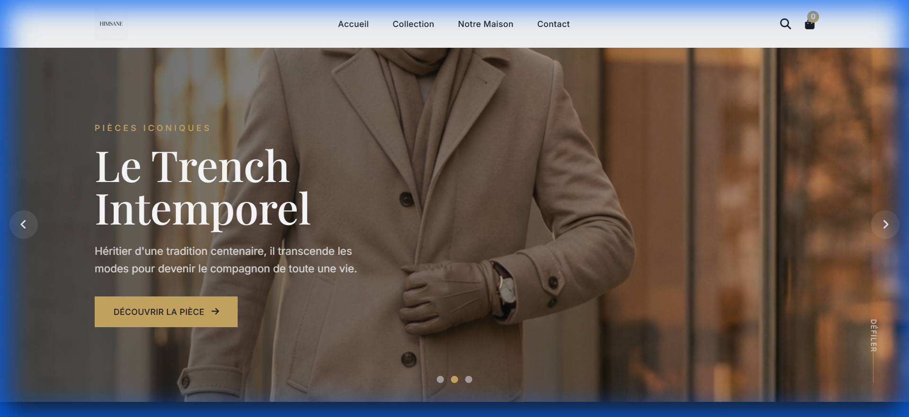
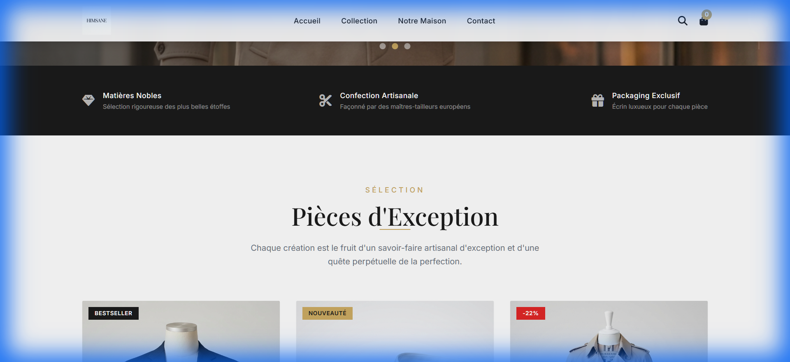
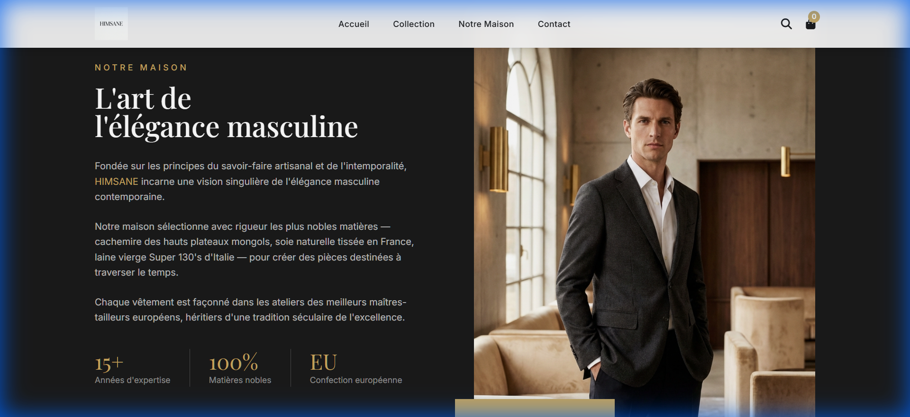
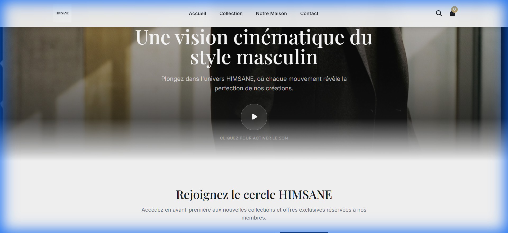
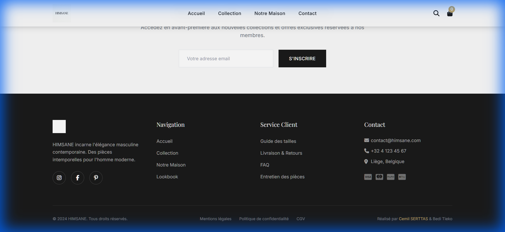
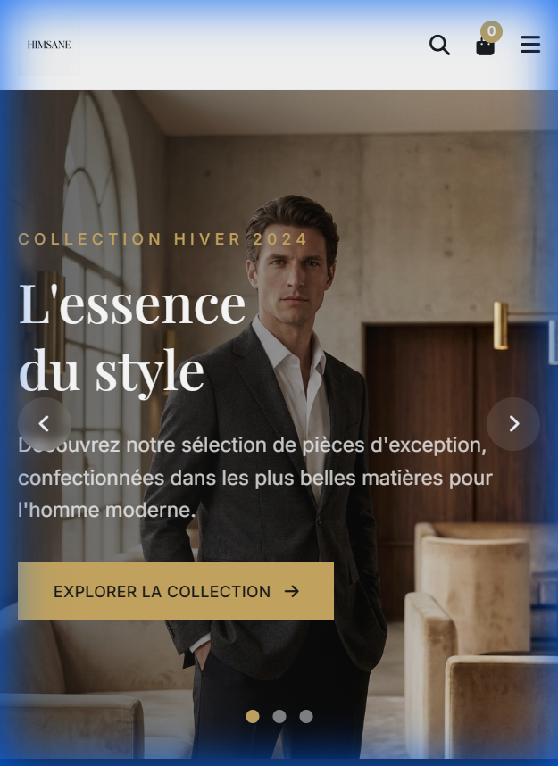
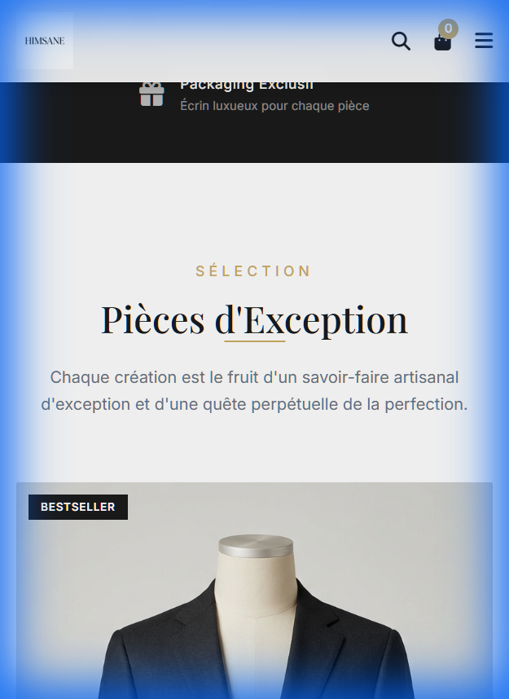
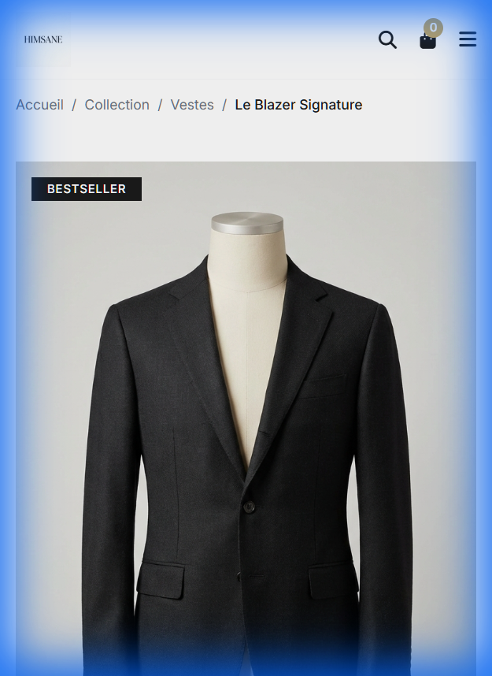

# 📋 RAPPORT FINAL - PROJET E-COMMERCE HIMSANE

---

## 📄 PAGE DE GARDE

| | |
|---|---|
| **Titre du projet** | Site E-commerce HIMSANE |
| **Type** | Boutique en ligne de mode masculine de luxe |
| **Étudiants** | **Cemil SERTTAS** & **Bedi Tieko** |
| **Formation** | EBUS 3 - Formation IA |
| **Établissement** | Haute École de la Province de Liège (HEPL) |
| **Date de rendu** | 05/01/2025 |
| **Lien site** | [himsane-ecommerce.netlify.app](https://himsane-ecommerce.netlify.app) |
| **Dépôt GitHub** | [github.com/cemilserttas/himsane-ecommerce](https://github.com/cemilserttas/himsane-ecommerce) |

---

## 📌 INTRODUCTION

### Présentation de la Marque

**HIMSANE** est une marque fictive de mode masculine de luxe créée dans le cadre d'un projet pédagogique. La marque incarne l'élégance intemporelle et l'audace moderne, destinée à des hommes urbains exigeants qui recherchent la quintessence du style.

### Slogan
> *"L'essence du style"*

### Positionnement
- **Segment** : Luxe / Premium
- **Cible** : Hommes actifs urbains, 28-45 ans, CSP+
- **Valeurs** : Savoir-faire • Intemporalité • Allure
- **Tone of Voice** : Sophistiqué, minimaliste, confiant

### Objectif du Projet
Concevoir et développer un site e-commerce vitrine complet, fonctionnel et responsif, en utilisant l'intelligence artificielle comme outil principal pour la génération de contenu (textes, images, code).

---

## 🛠️ MÉTHODOLOGIE & OUTILS

### Stack Technique

| Catégorie | Outil/Technologie | Utilisation |
|---|---|---|
| **IDE** | Anti-Gravity (Google) | Développement assisté par IA |
| **Framework CSS** | Tailwind CSS (CDN) | Styling moderne et responsive |
| **Icônes** | FontAwesome 6 | Iconographie |
| **Typographies** | Google Fonts | Playfair Display + Inter |
| **Versionning** | GitHub | Contrôle de version |
| **Hébergement** | Netlify | Déploiement continu |
| **IA Générative Texte** | Claude (Anthropic) | Copywriting, Code, Structure |
| **IA Générative Image** | Image AI (Google) | Logo, Bannières, Photos produits |

### Workflow de Développement

1. **Phase de Conception** : Définition de l'identité de marque via IA conversationnelle
2. **Phase de Production** : Génération des assets visuels et rédaction du contenu
3. **Phase de Développement** : Création du code HTML/CSS/JS assisté par IA
4. **Phase d'Intégration** : Assemblage des composants et tests responsive
5. **Phase de Documentation** : Compilation du rapport et déploiement final

---

## 📊 CATALOGUE DES PROMPTS IA

### Vue d'ensemble

| N° | Élément généré | IA utilisée | Itérations |
|---|---|---|---|
| 1 | Identité de marque | Claude | 1 |
| 2 | Charte graphique | Claude | 1 |
| 3 | Logo HIMSANE | Image AI | 1 |
| 4 | Hero Banner principal | Image AI | 1 |
| 5 | Photo Blazer Signature | Image AI | 1 |
| 6 | Photo Chemise Soie | Image AI | 1 |
| 7 | Photo Trench Intemporel | Image AI | 1 |
| 8 | Structure HTML/Tailwind | Claude | 1 |
| 9 | Fiches produits (copywriting) | Claude | 1 |
| 10 | Bannière Slider 2 (Trench) | Image AI | 1 |
| 11 | Bannière Slider 3 (Chemise) | Image AI | 1 |
| 12 | Page Mentions Légales | Claude | 1 |
| 13 | Page À Propos | Claude | 1 |
| 14 | Code Slider JavaScript | Claude | 1 |
| 15 | Tests Responsive | Claude | 1 |
| 16 | Section Vidéo Cinématique | Claude | 2 |
| 17 | Image Poster Vidéo | Image AI | 1 |

**Total : 17 prompts principaux | ~18 itérations**

### Détail des Prompts Clés

#### 🎨 Prompt #1 : Identité de Marque
```
"Agis comme un Directeur Artistique d'une grande maison de couture (type LVMH 
ou Kering). Je lance une marque de vêtements de luxe masculine en ligne appelée 
HIMSANE. Propose-moi :
1. Un concept de marque cohérent
2. Une tagline prestigieuse (3-4 mots max)
3. Le "Tone of Voice" idéal pour séduire une clientèle masculine exigeante
4. Un persona client type
5. Les 3 valeurs clés de la marque"
```

**Résultat** : Concept complet de marque luxe avec persona "Alexandre, 32 ans, urbain actif"

#### 🖼️ Prompt #3 : Logo
```
"Minimalist luxury fashion brand logo design for "HIMSANE" - sophisticated men's 
fashion brand. Clean, elegant typography with the word HIMSANE in a refined serif 
font. The design should be timeless, high-end, and suitable for a premium menswear 
label. Black text on white background. Simple, iconic, no additional graphics or 
symbols - just pure typography."
```

**Résultat** : Logo typographique minimaliste style Armani/Hugo Boss

#### 💻 Prompt #8 : Structure Code
```
"Génère un squelette HTML5 incluant le lien CDN de Tailwind CSS et FontAwesome 
pour les icônes. Le site doit avoir :
1. Un Header fixe avec logo, navigation et icônes panier/recherche
2. Une section Hero avec slider/carrousel
3. Une grille de produits vedettes (3 produits)
4. Une section À propos / Storytelling
5. Un Footer complet avec colonnes (Navigation, Service Client, Contact)
Utilise la palette : Primaire #1A1A1A, Secondaire #C9A962, Fond #FAFAFA"
```

**Résultat** : Pages index.html et product.html complètes (~800 lignes chacune)

#### ✍️ Prompt #9 : Copywriting Produits
```
"Rédige 3 fiches produits pour une marque de mode masculine luxe HIMSANE. 
Adopte un ton sophistiqué et minimaliste. Pour chaque produit, fournis :
1. Un nom de produit iconique
2. Une description courte (accroche)
3. Une description longue (storytelling sensoriel)
4. Caractéristiques techniques (Matière, Coupe, Origine, Entretien)
5. Un prix premium
6. 2 avis clients soignés axés sur la qualité"
```

**Résultat** : 3 fiches produits détaillées avec storytelling premium

---

## 📸 CAPTURES D'ÉCRAN DU SITE FINAL

### Vue Desktop (1920x1080)

**1. Page d'Accueil - Section Hero**

*Slider principal avec navigation et CTA*

**2. Page d'Accueil - Produits Vedettes**

*Grille de 3 produits avec effets hover*

**3. Section "Notre Maison" (Storytelling)**

*Section brand story avec statistiques*

**4. Section Vidéo Cinématique + Newsletter**

*Section immersive avec poster vidéo*

**5. Footer**

*Footer complet avec liens et informations*

### Vue Mobile (375x812)

**6. Accueil Mobile - Hero**

*Adaptation responsive du slider*

**7. Accueil Mobile - Produits**

*Grille en colonne unique*

**8. Page Produit Mobile**

*Layout produit adapté mobile*

---

## 🗂️ STRUCTURE DU PROJET

```
himsane-ecommerce/
├── index.html                 # Page d'accueil (43KB, ~900 lignes)
├── product-blazer.html        # Fiche produit Blazer Signature
├── product-chemise.html       # Fiche produit Chemise Soie
├── product-trench.html        # Fiche produit Trench Intemporel
├── product.html               # Template produit générique
├── apropos.html               # Page "Notre Maison"
├── mentions-legales.html      # Mentions légales complètes
├── cart.html                  # Page panier
├── checkout.html              # Page commande
├── faq.html                   # Questions fréquentes
├── guide-tailles.html         # Guide des tailles
├── 404.html                   # Page d'erreur personnalisée
├── data.json                  # Données produits (3 produits)
├── README.md                  # Documentation technique
├── prompts_log.txt            # Journal des prompts IA
│
├── /assets
│   ├── /images
│   │   ├── logo.png           # Logo HIMSANE
│   │   ├── hero-banner.png    # Bannière principale
│   │   ├── hero-banner-2.png  # Bannière Trench
│   │   ├── hero-banner-3.png  # Bannière Chemise
│   │   ├── blazer-signature.jpg
│   │   ├── chemise-soie.jpg
│   │   ├── trench-intemporel.jpg
│   │   └── video-poster.jpg   # Poster vidéo cinématique
│   └── /videos                # Dossier pour vidéo VEO3
│
├── /js
│   ├── main.js                # Scripts principaux (slider, menu)
│   └── cart.js                # Gestion du panier (localStorage)
│
└── /documentation
    ├── RAPPORT_FINAL_HIMSANE.md
    └── /screenshots           # Captures d'écran
```

---

## ✅ FONCTIONNALITÉS IMPLÉMENTÉES

### Pages
- [x] Page d'accueil avec slider 3 images
- [x] 3 pages produits détaillées
- [x] Page "Notre Maison" (À propos)
- [x] Page Mentions Légales
- [x] Page Panier
- [x] Page Checkout
- [x] Page FAQ
- [x] Page Guide des Tailles
- [x] Page 404 personnalisée

### Composants UI
- [x] Header fixe avec navigation
- [x] Menu mobile hamburger
- [x] Carrousel automatique avec navigation
- [x] Cartes produits avec effets hover
- [x] Section témoignages clients
- [x] Section réassurance (3 piliers)
- [x] Section vidéo cinématique
- [x] Newsletter avec animation
- [x] Footer complet multi-colonnes

### Fonctionnalités JavaScript
- [x] Slider automatique (5s) avec pause au hover
- [x] Navigation par flèches et dots
- [x] Menu mobile toggle
- [x] Gestion panier (localStorage)
- [x] Sélection couleur/taille produit
- [x] Accordéons page produit
- [x] Boutons +/- quantité
- [x] Contrôle son vidéo

### Responsive Design
- [x] Desktop (1920px+)
- [x] Laptop (1024px)
- [x] Tablette (768px)
- [x] Mobile (375px)

---

## 🤔 RÉFLEXION CRITIQUE SUR L'USAGE DE L'IA

### Points Forts

**1. Productivité Accrue**
L'IA a permis de développer un site e-commerce complet en quelques jours seulement. La génération de code, de textes marketing et d'images a été considérablement accélérée.

**2. Qualité Professionnelle**
Les outputs générés (copywriting luxe, code responsive, visuels produits) atteignent un niveau de qualité professionnelle difficile à atteindre sans expertise spécialisée.

**3. Cohérence de Marque**
En définissant un brief précis dès le départ, l'IA a maintenu une cohérence parfaite dans le tone of voice et l'esthétique visuelle tout au long du projet.

### Points de Vigilance

**1. Supervision Humaine Nécessaire**
L'IA propose, l'humain dispose. Chaque output a nécessité une validation et parfois des ajustements pour correspondre exactement à la vision du projet.

**2. Limites Créatives**
Les visuels générés, bien que professionnels, restent parfois génériques. Pour un projet réel, des photos authentiques resteraient préférables.

**3. Dépendance Technique**
Sans compréhension du HTML/CSS/JS, il serait difficile de corriger les erreurs ou d'adapter le code généré. L'IA augmente les compétences existantes, elle ne les remplace pas.

### Conclusion

L'intelligence artificielle s'impose comme un **multiplicateur de productivité** extraordinaire pour le développement web et la création de contenu. Elle permet de prototyper rapidement, d'explorer des directions créatives et de produire des résultats de qualité professionnelle.

Cependant, elle reste un **outil** au service de la vision humaine. La valeur ajoutée réside dans la capacité à poser les bonnes questions (prompts), à évaluer les résultats et à les intégrer dans une stratégie cohérente.

Pour ce projet HIMSANE, l'IA a été utilisée comme un **collaborateur virtuel** : généreuse en propositions, rapide en exécution, mais toujours guidée par nos décisions stratégiques et esthétiques.

---

## 📎 ANNEXES

- **Fichier complet des prompts** : `prompts_log.txt`
- **Code source** : Dépôt GitHub public
- **Site en ligne** : Hébergé sur Netlify
- **Captures d'écran** : Dossier `/documentation/screenshots/`

---

## ✍️ SIGNATURES

| Étudiant | Rôle | Signature |
|---|---|---|
| **Cemil SERTTAS** | Lead Developer (Profil A) | ___________________ |
| **Bedi Tieko** | Marketing & Design (Profil B) | ___________________ |

**Date de finalisation** : 31/12/2024

---

*Document généré dans le cadre du cours "IA & E-commerce" - HEPL - Janvier 2025*
